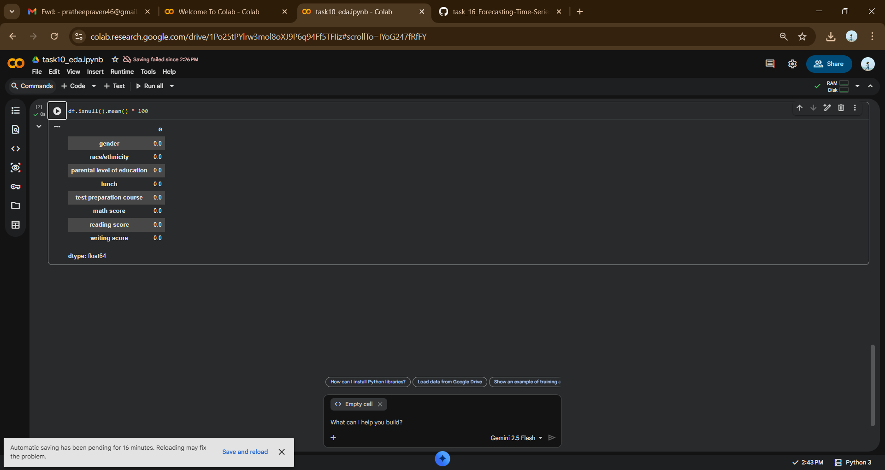
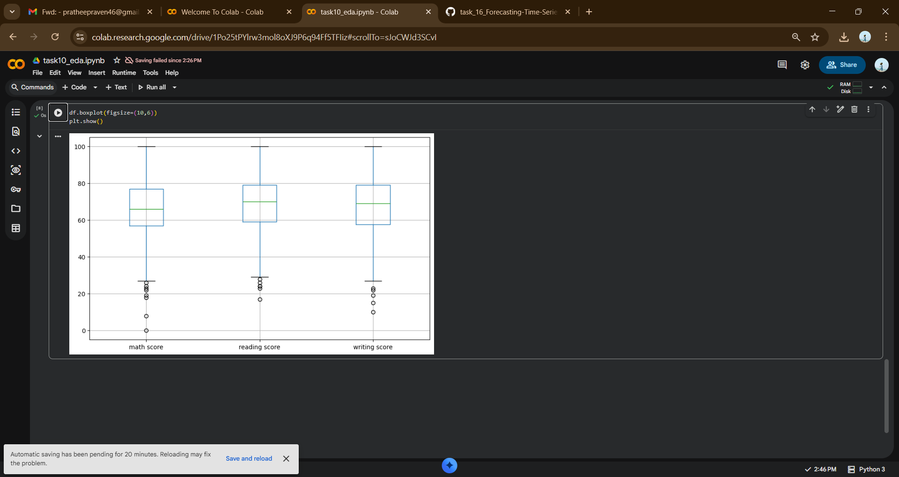

# Task 10 — Python EDA & Outlier Detection

## 📌 Objective
Perform Exploratory Data Analysis (EDA) and detect outliers using the IQR method.

## 🛠 Tools & Libraries
- Google Colab
- Python
- pandas
- numpy
- matplotlib

## 🔍 Steps Performed

1. Loaded dataset
2. Checked dataset structure (.shape, .info, .head)
3. Generated descriptive statistics
4. Checked missing values
5. Visualized distributions (Histogram)
6. Identified outliers (Boxplot)
7. Detected outliers using IQR
8. Created outlier flag column
9. Handled outliers (Capping Method)
10. Generated correlation matrix
11. Exported cleaned dataset

## 📊 Key Observations

- Dataset contains academic performance metrics.
- Minimal missing values.
- Some score columns showed mild outliers.
- Strong correlation observed between subject scores.

## 📸 Screenshots

### Dataset Preview

### Dataset Info

### Descriptive Statistics

### Missing Values

### Histograms

### Boxplot

### Outlier Detection

### Outlier Flag

## 📁 Files Included
- task10_eda.ipynb
- cleaned_dataset.csv
